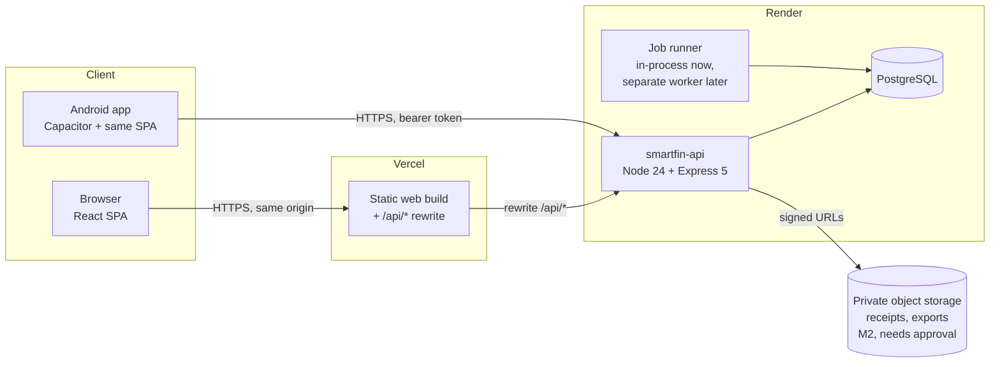

# SmartFin architecture

Status: **Proposed, M0 implemented** · Last updated: 2026-10-04

Companion documents: [ERD](erd.md) · [Permission matrix](permissions.md) · [Screen map](screen-map.md) · [Milestones](milestones.md) · [Deployment](deployment/README.md) · [PRD](PRD.md)

## 1. Overview

- **One TypeScript monorepo** (npm workspaces): `apps/web`, `services/api`, `packages/shared`, `database/`, later `apps/android`.
- **Vercel** serves only static assets. It forwards `/api/*` to Render, so the browser calls the API on its own origin. No secrets are configured in Vercel.
- **Render** runs the API, the job runner and PostgreSQL. All privileged logic and every authorization decision happens there.
- **Android** wraps the same web build with Capacitor. It talks to the Render API directly with a bearer session token, because a Capacitor WebView can't share first-party cookies with the Vercel domain.
- **Firebase is not part of the core path.** See [ADR-011](#adr-011-firebase-scope).

## 2. Architecture decision records

### ADR-001 Monorepo with npm workspaces

npm ships with Node, and both Vercel and Render detect npm workspaces without extra configuration. The repo root is this folder; the PRD's `smartfin/` is the repository name.

Deviation from the PRD's suggested tree: unit and integration tests sit next to the code they test (`*.test.ts`), because each workspace runs its own Vitest. `tests/e2e/` holds the cross-app Playwright suite (from M1). Background jobs live in `services/api` (`src/worker.ts`) and share the API's database code; they move into `services/worker` only if they ever need separate dependencies.

### ADR-002 API: Express 5 + Zod + generated OpenAPI

- Express 5, as the PRD suggests. Async errors propagate to the error handler natively.
- Zod schemas in `packages/shared` validate request bodies on the server, power form validation on the client, and generate the OpenAPI 3.1 document (`@asteasolutions/zod-to-openapi`). That gives one definition per payload, so docs can't drift from validation.
- Routes are versioned under `/api/v1`. Swagger UI is at `/api/docs` and the raw spec at `/api/v1/openapi.json`.
- Errors use one shape: `{ "error": { "code", "message", "details?", "requestId" } }`.
- List endpoints use cursor pagination (`?limit=&cursor=`) plus explicit filter and sort parameters.
- Mutations that can be retried (imports, transaction creation from drafts, payments marked against schedules) accept an `Idempotency-Key` header, stored per user for 24 h.

### ADR-003 PostgreSQL + Drizzle; PGlite for local development and tests

- Production: managed PostgreSQL on Render, reached with the `pg` driver over TLS.
- Local development and the automated test suite use **PGlite**, real PostgreSQL compiled to WebAssembly and run inside Node. Developers don't install a database, and tests run against real Postgres semantics (`numeric`, `timestamptz`, constraints, `gen_random_uuid()`). Setting `DATABASE_URL` switches to a real server.
- Drizzle ORM provides typed queries, and every query is parameterized. `drizzle-kit` generates plain SQL migrations into `database/migrations/`; they're reviewed in pull requests like code and applied by `npm run db:migrate`.
- All data access goes through the API. Clients never get database credentials.

### ADR-004 Authentication: opaque server-side sessions

- Passwords are hashed with **Argon2id** (`@node-rs/argon2`, OWASP parameters: m=19 MiB, t=2, p=1).
- On login the server creates a random 256-bit session token and stores only its SHA-256 hash in `user_sessions`. Revocation (sign out, password change, "sign out other devices", account deletion) takes effect on the next request. That's why JWTs were rejected: they can't be revoked before expiry without a server-side list anyway.
- **Web:** token in an `HttpOnly; Secure; SameSite=Lax` cookie on the Vercel origin (first-party thanks to the rewrite).
- **Android:** token in `Authorization: Bearer`, stored with Android Keystore-backed secure storage.
- Idle timeout 30 days, absolute lifetime 90 days, token rotated on privilege change.
- **CSRF** for cookie sessions: state-changing requests must carry `X-SmartFin-CSRF` (the session's CSRF token, returned by `/auth/session`). The `Origin` header must also match the allow-list. Bearer requests are exempt, since browsers don't attach them automatically.
- Email verification and password-reset tokens are single-use, hashed, and expire after 24 h and 30 min respectively.
- Optional Google sign-in (M1) uses the OpenID Connect authorization-code flow on the server. Accounts are linked by verified email only after the user confirms.
- Clients never send roles. The server loads them for every request.

### ADR-005 Same-origin API via Vercel rewrite

`apps/web/vercel.json` rewrites `/api/:path*` to the Render service. This means:

- First-party cookies with no third-party-cookie breakage (Safari ITP, Chrome).
- No CORS configuration for the browser.
- The API sees the client's address in `X-Forwarded-For`. `TRUST_PROXY_HOPS` tells Express how many proxies to trust: 2 behind Vercel and Render, 1 when called directly.

Trade-off: Vercel rewrites can't read environment variables, so the destination URL is written into `vercel.json`. Preview deployments use a second Vercel project, or a branch-specific `vercel.json` pointing at the staging API (see [deployment guide](deployment/README.md)).

### ADR-006 Money, dates and time

- Persisted amounts use `numeric(18,2)`. Rates use `numeric(9,4)`, units and grams `numeric(18,4)` and NAVs `numeric(18,4)`. Floats are never used.
- On the wire, amounts are **decimal strings** (`"123456.78"`). In code they go through `decimal.js` via `packages/shared/src/money.ts`. Rounding is half-up to 2 decimal places at presentation and at defined calculation steps, such as the EMI amount; each calculator documents its steps.
- Every amount carries an ISO 4217 currency code (`INR` in v1). Values in different currencies are never summed silently.
- Instants are `timestamptz`, stored in UTC. Financial dates such as due date, value date and maturity date are `date` columns with no time zone. Both are rendered in the user's time zone, `Asia/Kolkata` by default.
- Indian digit grouping (`₹1,23,456.78`) comes from `Intl.NumberFormat('en-IN')`.

### ADR-007 Authorization: deny by default, enforced in queries

- Every financial row has `owner_id`, `family_id`, `visibility` (`private` | `selected` | `family`) and `family_access` (`view` | `edit`).
- A single policy module, `services/api/src/authz`, answers `can(user, action, record)`. It also builds the SQL predicate that list and aggregate queries **must** use, so filtering happens in the database and isn't left to the client.
- Repository helpers require a request context (`ctx.userId`, memberships loaded from the database). A query without a context doesn't compile.
- Isolation tests (user A vs. B, member vs. private record, revoked grant) run in CI from M1. See [permissions.md](permissions.md).

### ADR-008 Background jobs on Postgres

- A `jobs` table, claimed with `FOR UPDATE SKIP LOCKED`, handles reminders, import processing, report generation and sync. Jobs have a `dedupe_key`, attempt counters and exponential back-off, so they're safe to retry.
- **Default:** the job runner runs inside the API process (`RUN_JOBS_IN_PROCESS=true`), so the free plan works.
- **With approval:** a separate Render Background Worker (`npm run worker -w services/api`) runs the same code.

### ADR-009 File storage (receipts, exports)

- Uses a storage interface with two drivers: local disk for development, and S3-compatible storage for staging and production (Cloudflare R2, AWS S3, or a Render disk).
- Downloads use short-lived signed URLs, issued only after an authorization check.
- Provider choice is **deferred to M2 and needs your approval**, because every option is an external or paid service.

### ADR-010 Android transaction-message assistant

Policy findings, checked 2026-10-04 (re-check before M5):

- **Google Play:** the _SMS or Call Log permissions_ policy allows `READ_SMS` / `RECEIVE_SMS` for "SMS-based money management (for example, apps that track and manage budget)". Using it requires a Permissions Declaration Form, and access must be the app's _core functionality_. Approval isn't guaranteed for an app where message reading is one optional feature.
- **Sideloaded APK:** since Android 13 (tightened in Android 15), apps installed outside an app store can't use notification-listener access or the SMS runtime permissions until the user turns on **Allow restricted settings** in App info.
- Google has announced developer verification for apps installed on certified devices, rolling out by region. Check whether it applies to India before distributing the APK outside Play.

Decision: build a **pluggable message source** with three providers, all feeding one on-device deterministic parser:

1. **User-initiated share/paste** of a message into the app. Needs no special permission and always works.
2. **Notification listener**, user-enabled in system settings. Reads only notifications from an allow-list of bank and UPI apps.
3. **SMS receiver** (`RECEIVE_SMS`). Included only in a build flavour used for sideload or Play distribution after the Play declaration is approved.

Raw text is parsed on the device and then discarded. Drafts live in local device storage. Only fields the user confirms reach the API, as a normal transaction with `source = message_draft` and a one-way fingerprint hash for duplicate detection. OTP, promotional and balance-only messages are dropped before anything is stored.

### ADR-011 Firebase scope

- **Not used** for authentication, the primary database, analytics or file storage.
- **Android reminders use Capacitor Local Notifications** scheduled on the device from synced data, so they don't need Firebase. Server-sent push through Firebase Cloud Messaging is an optional add-on (M5), needing a Firebase project and your approval.
- **Optional "Firebase sync" (M6):** a one-way, consented mirror of selected categories (for example, monthly summaries) from the API to Firestore, owned by a family owner or admin. It runs server-side with Firebase Admin credentials held only on Render. The toggle won't appear in the UI until this integration works.

### ADR-012 Web front end

- React 19 + Vite + TypeScript. React Router for routes, TanStack Query for server state.
- A small in-house design system (`apps/web/src/ui`) built on CSS custom properties: light and dark themes, accessible contrast, visible focus rings and screen-reader labels. No UI framework dependency, so the bundle stays small for the WebView.
- Every value shown can carry a provenance badge: _actual_, _estimated_, _forecast_, _imported_, _last updated_.

## 3. Calculations and provenance

- Calculators live in `packages/shared/src/calc/` as pure functions with unit tests: EMI, amortisation, FD/RD maturity, SIP returns (absolute and XIRR), gold valuation, net worth, savings rate.
- Each one returns `{ value, method, assumptions[] }`, so the UI and reports can show how a figure was derived.
- Stored values carry `value_source` (`manual` | `imported` | `message_draft` | `calculated` | `external`) and `as_of`.
- **Double-counting rules:**
  - A transfer is one row with two accounts.
  - A credit-card bill payment is a `liability_payment` (account → card), not an expense.
  - The card purchase is the expense.
  - Credit limits are never assets.
  - Family totals de-duplicate by record id, so a shared joint account counts once.

## 4. Observability and operations

- Pino structured JSON logs. Every request gets a correlation id (`X-Request-Id`, taken from the incoming header or generated) that appears in logs and error bodies. Sensitive fields (passwords, tokens, cookies, authorization headers) are redacted.
- Health checks:
  - `GET /api/v1/health`: liveness (process up).
  - `GET /api/v1/health/ready`: readiness (database reachable, migrations applied). Render's health check uses this one.
- Audit events are written in the same database transaction as the change they describe. They store safe before/after metadata, never secrets.
- Error tracking (for example Sentry) is optional and needs approval. Until then, errors are logged with correlation ids.
- Backups: Render's managed backups on paid Postgres plans, plus a documented `pg_dump` restore drill (M6).

## 5. Hosting constraints and costs to approve

Nothing paid has been added. Verify current prices on the providers' pricing pages before deciding.

| Item                                | Free option                    | Limitation                                                                                           | Needed for                                                   |
| ----------------------------------- | ------------------------------ | ---------------------------------------------------------------------------------------------------- | ------------------------------------------------------------ |
| Render web service                  | Free instance                  | Sleeps after ~15 min idle; first request after sleep is slow; in-process jobs don't run while asleep | Production reliability, server reminders                     |
| Render PostgreSQL                   | Free instance                  | Expires after 30 days; no backups                                                                    | **Any real data:** a paid plan is required before production |
| Render Background Worker / Cron Job | None                           | Paid only                                                                                            | Separate job runner (optional; in-process works meanwhile)   |
| Render pre-deploy command           | Paid instances                 | Free plan must run migrations manually from a shell                                                  | Automatic migrations on deploy                               |
| Vercel                              | Hobby                          | Hobby is for non-commercial personal use                                                             | Pro if SmartFin is used commercially                         |
| Object storage                      | Some providers have free tiers | External account                                                                                     | Receipts and exports (M2)                                    |
| Email delivery                      | Some providers have free tiers | External account plus domain verification                                                            | Email verification and password reset (M1)                   |
| Firebase Cloud Messaging            | Free                           | Firebase project                                                                                     | Optional server push (M5)                                    |
| Google sign-in                      | Free                           | Google Cloud OAuth client                                                                            | Optional (M1)                                                |

## 6. Assumptions

1. The repository root is `D:\myaccountmanager`, with GitHub as the remote (you create the GitHub repo).
2. v1 handles INR only. Currency columns exist so other currencies can be added without migration.
3. The schema supports many families per user. **v1 UI limits a user to one family** to keep sharing easy to understand; the family switcher can come later.
4. A family owner sees only records shared with them, as the PRD states. Owning the family grants no data access.
5. Until an email provider is approved, verification and reset emails are written to the API log in development and the feature is marked "not yet available" in production.
6. Account linking means a member relationship plus sharing grants. No bank credentials are ever involved.
7. The rounding mode is half-up to paisa for display and EMI amounts. It can be changed in `money.ts`.
8. The AI assistant (PRD §5.16) is out of scope until you approve a provider. No financial data leaves the system for AI.
