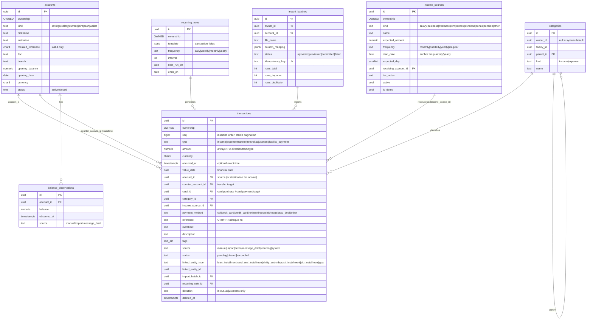
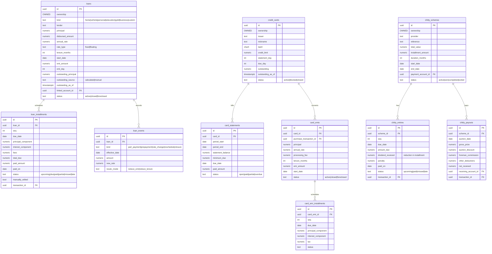
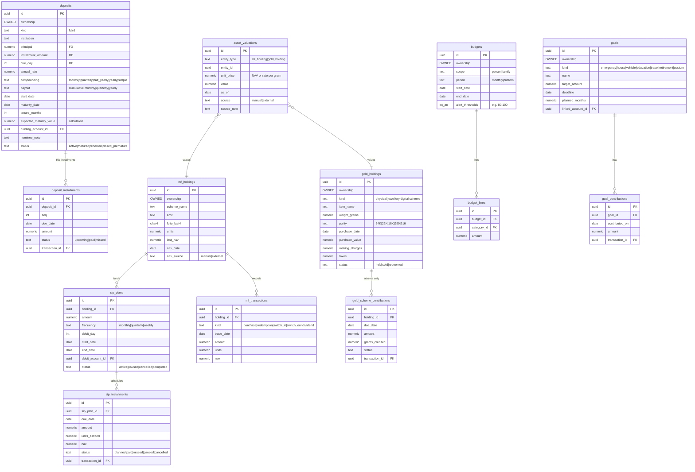
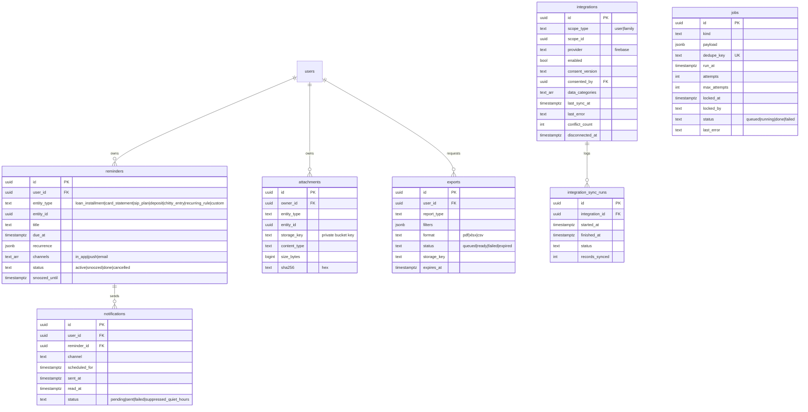

# SmartFin data model (ERD)

Status: **Design for all milestones.** Tables are created by migrations in the milestone that first uses them; the [milestones](milestones.md) list which. Conventions are in [architecture ADR-006/007](architecture.md#adr-006-money-dates-and-time).

## Conventions

- **Primary keys:** `uuid` (`gen_random_uuid()`).
- **Hashes and emails:** hashes are hex `text`. Emails are `text` with a lower-case check constraint, so no extension (citext) is needed and PGlite stays compatible.
- **Timestamps:** `created_at`, `updated_at` as `timestamptz` (UTC). Soft delete through `deleted_at`. Optimistic concurrency through `version int`; an update must send the version it read.
- **Ownership block**, on every financial table (shown as `OWNED` below):
  `owner_id → users`, `family_id → families (nullable)`, `visibility ('private'|'selected'|'family')`, `family_access ('view'|'edit')`, `created_by`, `updated_by`.
- **Money:** `numeric(18,2)` plus `currency char(3)`. Rates `numeric(9,4)` (percent per annum). Units, grams and NAV `numeric(18,4)`.
- **Provenance:** `value_source ('manual'|'imported'|'message_draft'|'calculated'|'external')` plus `as_of` wherever a balance or valuation is stored.
- **Masking:** only the **last four digits** of account, card and folio numbers are stored (`char(4)`). No full numbers, CVV, PIN, OTP or passwords are stored anywhere.
- **Polymorphic links** (`entity_type`, `entity_id`) are used only for cross-cutting tables (sharing grants, attachments, reminders, audit). `entity_type` is a checked enum.

## 1. Identity, family and sharing

```mermaid
erDiagram
  users ||--o{ user_sessions : has
  users ||--o{ email_tokens : has
  users ||--o{ auth_identities : "links (Google)"
  users ||--o{ family_members : joins
  families ||--o{ family_members : has
  families ||--o{ family_invitations : issues
  users ||--o{ sharing_grants : "grants / receives"
  users ||--o{ consents : records
  users ||--o{ audit_events : acts

  users {
    uuid id PK
    text email UK "stored lower-cased"
    timestamptz email_verified_at
    text password_hash "argon2id, nullable for Google-only"
    text display_name
    char3 preferred_currency "INR"
    text time_zone "Asia/Kolkata"
    jsonb preferences "dashboard cards, hidden modules, notification prefs, quiet hours, lock-screen amounts"
    timestamptz deleted_at
  }
  user_sessions {
    uuid id PK
    uuid user_id FK
    text token_hash UK "sha256 hex"
    text client "web|android"
    text user_agent
    timestamptz last_seen_at
    timestamptz idle_expires_at
    timestamptz absolute_expires_at
    timestamptz revoked_at
  }
  email_tokens {
    uuid id PK
    uuid user_id FK
    text purpose "verify_email|reset_password"
    text token_hash UK "sha256 hex"
    timestamptz expires_at
    timestamptz used_at
  }
  auth_identities {
    uuid user_id FK
    text provider "google"
    text provider_subject UK
  }
  families {
    uuid id PK
    text name
    uuid owner_user_id FK
    char3 base_currency
  }
  family_members {
    uuid family_id PK, FK
    uuid user_id PK, FK
    text role "owner|admin|member|read_only|custom"
    jsonb permissions "custom role: module -> actions[]"
    text status "active|removed|left"
  }
  family_invitations {
    uuid id PK
    uuid family_id FK
    text email "lower-cased"
    text role
    text token_hash UK "sha256 hex"
    uuid invited_by FK
    timestamptz expires_at
    text status "pending|accepted|declined|revoked|expired"
  }
  sharing_grants {
    uuid id PK
    text record_type
    uuid record_id
    uuid grantor_id FK
    uuid grantee_id FK
    text_arr permissions "view|edit|delete|export|share"
    timestamptz expires_at
    timestamptz revoked_at
  }
  consents {
    uuid id PK
    uuid user_id FK
    text kind "privacy_notice|message_assistant|firebase_sync|ai_assistant"
    text version
    timestamptz granted_at
    timestamptz withdrawn_at
  }
  audit_events {
    uuid id PK
    uuid actor_user_id FK
    uuid family_id
    text action
    text entity_type
    uuid entity_id
    text request_id
    jsonb metadata "safe before/after, never secrets"
    timestamptz created_at
  }
```

## 2. Core money (accounts, cash, transactions, income)

As built in M2:

- **Balances are calculated, not stored:** opening balance plus every non-deleted transaction dated from the opening date to today (`services/api/src/modules/ledger.ts`). A stored balance could drift; a calculation can't.
- **Expected vs received** is calculated per month: expected from the source's amount and frequency, received from income transactions linked by `income_source_id`. There is no separate expectations table to keep in sync.
- **Duplicates** are found by query (same account, type and amount within 2 days, then compared by reference or date and description), so there is no stored fingerprint yet. Message drafts (M5) may add one.
- `accounts.is_demo`, `income_sources.is_demo` and `transactions.source = 'demo'` mark synthetic data so reset removes exactly that.

Ledger rules:

- `income` adds to `account_id`. `expense` subtracts from `account_id`, or adds to the card outstanding when `card_id` is set.
- `transfer` moves money `account_id` → `counter_account_id`. `liability_payment` moves money `account_id` → `card_id`, or to a loan installment through `linked_entity`.
- `refund` reverses an expense. `adjustment` reconciles to an observed balance.
- Only `income` and `expense` (net of `refund`) count toward income and expense totals.

## 3. Commitments (loans, cards, chitty)

## 4. Wealth (deposits, mutual funds, gold) and planning

## 5. Reminders, files, integrations and jobs

## Not stored on the server

- **Message-assistant drafts and processing history:** kept in on-device storage only. Raw message text is discarded after parsing. Only confirmed, normalized transaction fields are sent (plus a one-way fingerprint for duplicate detection, added in M5).
- **Idempotency keys:** a `idempotency_keys(user_id, key, request_hash, response, expires_at)` table with a 24 h TTL. It's operational, so it's omitted from the diagrams above.

## Key indexes (planned)

- `transactions (owner_id, value_date desc, seq desc) where deleted_at is null`; `(account_id, value_date)`; `(counter_account_id)`; `(category_id)`, `(income_source_id)`, `(import_batch_id)` (built in M2). `(family_id, visibility, value_date desc)` arrives with family sharing.
- `sharing_grants (grantee_id, record_type, record_id) where revoked_at is null`.
- `family_members (user_id) where status = 'active'`.
- `user_sessions (token_hash)` unique; `email_tokens (token_hash)` unique.
- Installment tables: `(parent_id, due_date)`; reminders `(user_id, due_at) where status = 'active'`.
- `jobs (status, run_at)`; unique `dedupe_key`.
- `audit_events (actor_user_id, created_at desc)`; `(entity_type, entity_id, created_at desc)`.

## Retention and deletion

- **Account deletion:** the user's sessions are revoked immediately. After a 7-day undo window, the user's owned financial records and attachments are hard-deleted. Records already shared with others are deleted too, and recipients are told. Audit events are kept with the actor id pseudonymised (needed for security investigation). Get legal review of this retention before production.
- **Exports:** files expire after 24 h and are then deleted from storage.
- **Soft-deleted transactions:** purged after 90 days.
