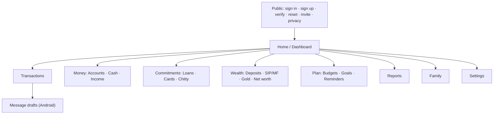

# SmartFin screen map

Status: **Design.** The same React routes serve the web app and the Android app. Screens marked _Android_ exist only in the Capacitor build. A milestone tag shows when each screen arrives.

## Navigation

- **Mobile and Android:** bottom bar with Home · Transactions · ➕ Add · Plan · More.
- **Desktop:** sidebar with the same groups expanded.
- A **scope switcher** in the header (Me / _member name_ / Family) changes every list and dashboard. It shows only scopes the viewer has access to.

## Routes

### Public

| Route                                        | Screen                                                       | Milestone |
| -------------------------------------------- | ------------------------------------------------------------ | --------- |
| `/signin`                                    | Email + password; Google button if configured                | M1        |
| `/signup`                                    | Name, email, password; privacy notice consent                | M1        |
| `/verify-email?token=`                       | Verification result                                          | M1        |
| `/forgot-password`, `/reset-password?token=` | Request reset; set new password                              | M1        |
| `/invite/:token`                             | Family invitation details; accept/decline (sign-in required) | M1        |
| `/privacy`                                   | Privacy notice and data practices                            | M1        |

### App

| Route                              | Screen                    | Key contents                                                                                                                                                                             | Milestone |
| ---------------------------------- | ------------------------- | ---------------------------------------------------------------------------------------------------------------------------------------------------------------------------------------- | --------- |
| `/`                                | **Dashboard**             | M0: system status. Later: configurable cards (liquid funds, net worth, income/expense, savings rate, EMIs, card dues, investments, chitty, upcoming payments), charts, provenance badges | M0 → M6   |
| `/transactions`                    | Transaction list          | Search, filters (date, member, account, category, type, method, tags), day/week/month/year grouping, bulk edit                                                                           | M2        |
| `/transactions/new`, `/:id`        | Transaction form / detail | Type-aware fields, receipt, audit history, duplicate warning                                                                                                                             | M2        |
| `/transactions/import`             | Statement import wizard   | Upload CSV/XLSX → map columns → preview with duplicates flagged → confirm                                                                                                                | M2        |
| `/transactions/recurring`          | Recurring rules           | List, pause, edit next run                                                                                                                                                               | M2        |
| `/accounts`, `/accounts/:id`       | Bank accounts             | Balances with freshness, history, reconcile, share settings                                                                                                                              | M2        |
| `/cash`                            | Cash & wallets            | In-hand balances, quick add, reconcile                                                                                                                                                   | M2        |
| `/income`, `/income/:id`           | Income sources            | Expected vs received, source mix, pending                                                                                                                                                | M2        |
| `/loans`, `/loans/:id`             | Loans & EMIs              | Schedule table (editable), events (prepayment, rate change), interest paid                                                                                                               | M3        |
| `/cards`, `/cards/:id`             | Credit cards              | Outstanding, utilization (estimate), statements, card EMIs                                                                                                                               | M3        |
| `/chitty`, `/chitty/:id`           | Chitty schemes            | Contributions, payout with deductions breakdown, remaining obligations                                                                                                                   | M3        |
| `/reminders`                       | Reminders & calendar      | List + month calendar, snooze, complete, recurrence                                                                                                                                      | M3        |
| `/deposits`, `/deposits/:id`       | FD / RD                   | Maturity calendar, installments, estimated interest                                                                                                                                      | M4        |
| `/investments`, `/investments/:id` | SIP & mutual funds        | Holdings, SIP plans, installments, manual NAV, returns (method shown)                                                                                                                    | M4        |
| `/gold`, `/gold/:id`               | Gold                      | Holdings by kind, scheme contributions, valuation history                                                                                                                                | M4        |
| `/net-worth`                       | Net worth                 | Assets vs liabilities breakdown, trend, inclusion rules                                                                                                                                  | M4        |
| `/budgets`, `/budgets/:id`         | Budgets                   | Planned vs actual by category, thresholds                                                                                                                                                | M4        |
| `/goals`, `/goals/:id`             | Goals                     | Progress, contribution plan                                                                                                                                                              | M4        |
| `/reports`                         | Report catalogue          | Report definitions, filters, run, export PDF/XLSX/CSV, export history                                                                                                                    | M6        |
| `/family`                          | Family                    | Members, roles, invitations, "shared with me / by me" overview                                                                                                                           | M1        |
| `/family/sharing`                  | Sharing overview          | Every shared record with who can view/edit, revoke                                                                                                                                       | M1        |
| `/settings/profile`                | Profile                   | Name, currency, time zone, date format                                                                                                                                                   | M1        |
| `/settings/security`               | Security                  | Change password, active sessions (revoke), Google link                                                                                                                                   | M1        |
| `/settings/notifications`          | Notifications             | Channels, quiet hours, lock-screen amounts toggle                                                                                                                                        | M3        |
| `/settings/dashboard`              | Dashboard & modules       | Show/hide cards and modules                                                                                                                                                              | M6        |
| `/settings/data`                   | Data & sync               | Export all data, demo data reset, delete account, Firebase sync (shown only once functional)                                                                                             | M2 / M6   |
| `/settings/message-assistant`      | Message assistant         | _Android._ OFF by default, explanation, permission status, local history, delete message-derived data                                                                                    | M5        |
| `/drafts`                          | Draft review queue        | _Android._ Extracted fields, confidence, confirm/edit/ignore/mark duplicate/report                                                                                                       | M5        |
| `/assistant`                       | AI assistant              | Shown only once a provider is approved and enabled                                                                                                                                       | Later     |
| `*`                                | Not found                 |                                                                                                                                                                                          | M0        |

## Shared UI patterns

- **Empty states** explain the module and offer one primary action.
- **Destructive actions** need confirmation, and soft-deleted items can be undone through a toast for 10 s.
- **Provenance badges** (_actual_, _estimated_, _forecast_, _imported_, _from message_, _updated 3 d ago_) appear on balances, valuations and totals.
- **Sharing chip** on every record: 🔒 Private / 👥 Family (view|edit) / 👤 Shared with N. Opening it shows exactly who has access.
- **Amounts** use Indian grouping: ₹1,23,456.78.
- **Accessibility:** keyboard navigation, visible focus, labelled controls, WCAG AA contrast in both themes.
